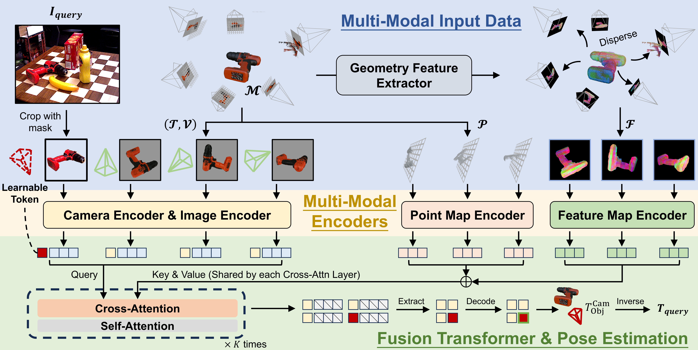

<div align="center">

<h1><a href="https://arxiv.org/abs/2512.10840">PoseGAM: Robust Unseen Object Pose Estimation via Geometry-Aware Multi-View Reasoning</a></h1>

**[Jianqi Chen](https://windvchen.github.io/), [Biao Zhang](https://scholar.google.co.uk/citations?user=h5KukxEAAAAJ&hl=en&oi=ao), [Xiangjun Tang](https://scholar.google.co.uk/citations?user=9vZn91sAAAAJ&hl=en&oi=ao), and [Peter Wonka](https://scholar.google.co.uk/citations?user=0EKXSXgAAAAJ&hl=en)**


[](#License)
[](https://arxiv.org/abs/2512.10840)
<a href='https://windvchen.github.io/PoseGAM/'>
  </a>

</div>


### Share us a :star: if this repo does help

This is the official repository of ***PoseGAM*** (**CVPR 2026 Oral**). If you encounter any
question, please feel free to open an issue or email me at windvchen@gmail.com. Ideas and
discussions are always welcome.

## Updates

[**2026/06/14**] 🚀 Released the code, pretrained model, and dataset-preparation pipeline.
This release is an **improved version** of our initial [arXiv paper](https://arxiv.org/abs/2512.10840):
we add a **mask-prediction head** that suppresses the impact of noisy CNOS segmentation masks,
giving large gains in BOP Average Recall (AR) **without** using refinement network or
multi-hypothesis strategy — e.g. **YCB-V 47.4 → 60.2** and **TUDL 56.8 → 69.5**.
We also improve the pose post-conversion logic for BOP evaluation (now a PnP-based solve instead of the SVD
approach in the initial paper).

[**2026/04/09**] Selected as an **Oral** paper at CVPR 2026. 🎉

[**2026/02/21**] Accepted by **CVPR 2026**.

[**2025/12/11**] Repository init.

## Table of Contents
- [Abstract](#abstract)
- [Installation](#installation)
- [Dataset Preparation](#dataset-preparation)
- [Pretrained Model](#pretrained-model)
- [Training](#training)
- [Evaluation](#evaluation)
- [Visualization](#visualization)
- [Results](#results)
- [Citation \& Acknowledgments](#citation--acknowledgments)
- [License](#license)

## Abstract



6D object pose estimation, which predicts the transformation of an object relative to the camera, remains challenging for unseen objects. Existing approaches typically rely on explicitly constructing feature correspondences between the query image and either the object model or template images. In this work, we propose PoseGAM, **a geometry-aware multi-view framework that directly predicts object pose from a query image and multiple template images, eliminating the need for explicit matching**. Built upon recent multi-view-based foundation model architectures, the method integrates object geometry information through two complementary mechanisms: explicit point-based geometry and learned features from geometry representation networks. In addition, we construct **a large-scale synthetic dataset containing more than 190k objects under diverse environmental conditions** to enhance robustness and generalization. Extensive evaluations across multiple benchmarks demonstrate our state-of-the-art performance.

## Installation

The code is tested with **Python 3.10**, **CUDA 12.1**, and **PyTorch 2.4.0**.

```bash
conda create -n posegam python=3.10 -y
conda activate posegam

# 1) PyTorch — install from the official index so you get the CUDA (not CPU-only) build
pip install torch==2.4.0 torchvision==0.19.0 --index-url https://download.pytorch.org/whl/cu121

# 2) Python dependencies
pip install -r requirements.txt

# 3) CUDA-compiled extras (must match your torch / CUDA build)
pip install git+https://github.com/NVlabs/nvdiffrast.git          # rendering for evaluation
pip install spconv-cu120==2.3.6                                   # SONATA geometry-encoder backend
pip install torch-scatter -f https://data.pyg.org/whl/torch-2.4.0+cu121.html
```

> The data-preparation pipeline (Blender rendering, remeshing, etc.) and the BOP-toolkit
> evaluation use additional, self-contained environments — see [DATASET.md](DATASET.md) and
> the [Evaluation](#evaluation) section.

## Dataset Preparation

PoseGAM is trained on a large-scale synthetic dataset rendered from
[TRELLIS-500K](https://github.com/microsoft/TRELLIS/blob/68820295a6ff17b44117d7439d0a244bd9c7826e/DATASET.md)
assets (we now also support training on optional [MegaPose](https://github.com/megapose6d/megapose6d) data), and is
evaluated on the BOP benchmark. The full preparation pipeline — download → convert → remesh →
multi-view render → image editing → base-color/normal rendering, plus BOP evaluation data —
is documented in:

### 👉 [DATASET.md](DATASET.md)

When the data is ready, point the `data_root` entries in
[`posegam/training/config/default.yaml`](posegam/training/config/default.yaml) to the rendered
`renders3/` folders (the loader auto-discovers the sibling folders).

## Pretrained Model

Download the pretrained checkpoint **`posegam.pt`** and place it at the repository root (or
pass its path via `--model_path` / `checkpoint.resume_checkpoint_path`):

| Model | Link |
|-------|------|
| PoseGAM | [Google Drive](https://drive.google.com/file/d/1ZevIWygcdvoaPhhydtgVDDfY8XgrGX2F/view?usp=sharing) |

## Training

Training is configured via Hydra ([`posegam/training/config/default.yaml`](posegam/training/config/default.yaml)).
Set the dataset `data_root`s, the batch/learning-rate settings, and optionally
`checkpoint.resume_checkpoint_path` (e.g. to fine-tune from `posegam.pt`). Launch with
`torchrun` (DDP):

> **Choosing datasets.** The default config trains on *all* prepared datasets (the TRELLIS-500K
> subsets and the optional MegaPose GSO/ShapeNet sets) under `data.train.dataset.dataset_configs`
> (and likewise for `data.val`). Comment out any entry you don't have or don't want to train on —
> keep only the datasets you prepared.

```bash
# multi-GPU (e.g. 8 GPUs on one node)
torchrun --nproc_per_node=8 -m posegam.training.launch

# single GPU
torchrun --nproc_per_node=1 -m posegam.training.launch
```

Checkpoints and TensorBoard logs are written under the `logging.log_dir` / `checkpoint.save_dir`
defined in the config.

## Evaluation

Evaluation has two stages: (1) run PoseGAM to predict object poses into a CSV, then (2) score
that CSV with the official BOP toolkit.

First prepare the BOP evaluation data (rendered reference views + CNOS detections) by following
the **"Optional: BOP evaluation data"** section in [DATASET.md](DATASET.md).

**1. Predict poses with PoseGAM.** Supported datasets: `lmo`, `tless`, `tudl`, `icbin`, `ycbv`.

```bash
python -m posegam.evaluation.test_BOP_benchmark \
    --BOP_dir       /path/to/BOP-data \
    --BOP_dataset_name ycbv \
    --BOP_query_dir /path/to/gigapose/gigaPose_datasets/datasets/tmp \
    --model_path    ./posegam.pt
```

For multi-GPU/multi-process runs add `--total_ranks N --rank_id r`; each rank writes
`<output_name>_<dataset>_results_rank<r>_of_<N>.csv`. Merge them into one BOP-toolkit result
file:

```bash
python -m posegam.evaluation.combine_csv \
    -d /path/to/results -p "posegam_ycbv_results_rank*_of_*.csv" \
    -o posegam_ycbv-test_combined.csv
```

**2. Compute BOP metrics** with the [BOP toolkit](https://github.com/thodan/bop_toolkit/tree/0050f298003fdc6360389ccae6a1a541726d878e)
(use the pinned commit above). Clone it and install its environment following its own README,
then point it at your data by editing two files:

- `bop_toolkit_lib/config.py` → `default_paths`:
  - `BOP_PATH` — the BOP datasets root (your gigapose `gigaPose_datasets/datasets` directory)
  - `BOP_RESULTS_PATH` — the folder holding your combined result CSV
  - `BOP_EVAL_PATH` — an output folder for the computed scores
- `scripts/eval_bop19_pose.py` → set the `--result_filenames` default to your combined CSV
  (named `<method>_<dataset>-test_*.csv`) and `--eval_path` to your eval output folder.

```bash
# inside the bop_toolkit repo
python scripts/eval_bop19_pose.py --result_filenames posegam_ycbv-test_combined.csv
```

## Visualization

Tools to render and compare predicted poses across methods live in
[`posegam/evaluation/visualization/`](posegam/evaluation/visualization). Given per-method result
CSVs laid out as `<compare_dir>/<dataset>/<method>.csv` (e.g. `gt.csv`, `ours.csv`, …):

```bash
# 1) render each method's predicted pose over the query image
python -m posegam.evaluation.visualization.compare_methods_visualize \
    --datasets ycbv --compare_dir ./compare-draw \
    --tmp_dir /path/to/gigapose/gigaPose_datasets/datasets/tmp \
    --mesh_root /path/to/BOP-data --output_dir ./comparison_results

# 2) composite the per-method overlays into one image per sample
python -m posegam.evaluation.visualization.visualize_results --input-dir ./comparison_results

# 3) stitch the per-method images across samples into GIFs
python -m posegam.evaluation.visualization.combine_to_gif --root_path ./comparison_results
```

## Results

<div align=center></div>

## Citation & Acknowledgments
If you find this paper useful in your research, please consider citing:
```bibtex
@inproceedings{chen2026posegam,
  title={PoseGAM: Robust Unseen Object Pose Estimation via Geometry-Aware Multi-View Reasoning},
  author={Chen, Jianqi and Zhang, Biao and Tang, Xiangjun and Wonka, Peter},
  booktitle={Proceedings of the IEEE/CVF Conference on Computer Vision and Pattern Recognition},
  pages={7197--7208},
  year={2026}
}
```

This project builds on a number of excellent open-source works, including
[VGGT](https://github.com/facebookresearch/vggt), [SONATA](https://github.com/Pointcept/Pointcept),
[TRELLIS](https://github.com/microsoft/TRELLIS), [MegaPose](https://github.com/megapose6d/megapose6d),
[gigapose](https://github.com/nv-nguyen/gigapose), and the [BOP toolkit](https://github.com/thodan/bop_toolkit).
We thank the authors for releasing their code and data.

## License

Our code is released under the Apache-2.0 license (see [LICENSE](LICENSE)). Some parts are derived
from third-party projects and keep their original licenses:

| Code | Origin | License |
|---|---|---|
| Original PoseGAM code, `posegam/layers` (from DINOv2/timm), `posegam/dependency/sonata` | This work / Apache-2.0 sources | [LICENSE](LICENSE) (Apache-2.0) |
| Files with the VGGT header (`posegam/models`, `posegam/heads`, `posegam/training`, `posegam/utils`, `posegam/evaluation`, …) | Derived from [VGGT](https://github.com/facebookresearch/vggt) | [LICENSE_VGGT](LICENSE_VGGT) |